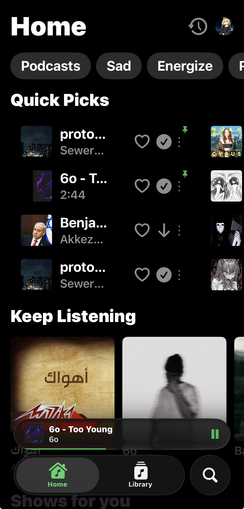
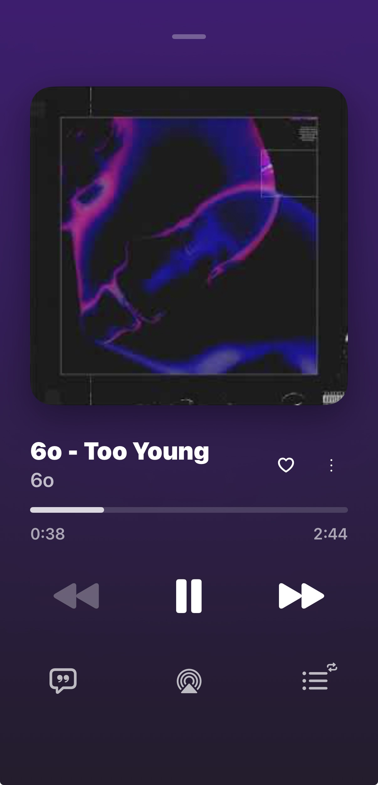
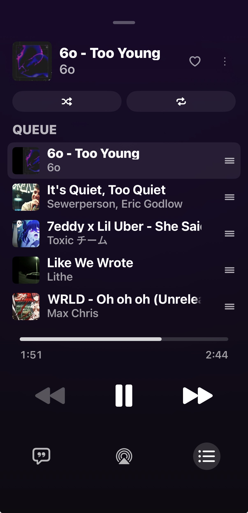

# Trop

A free and open source YouTube Music client for iOS.

| | | |
|:---:|:---:|:---:|
|  |  |  |

## Features

- No ads
- Stream songs and videos from YouTube Music
- Synced lyrics (Musixmatch, Netease, Kugou, LRCLIB, Genius)
- Library sync (playlists, albums, artists, podcasts)
- Downloads
- Equalizer
- Custom app icons and themes
- Queue management and listening history

## Installation

Requires iOS 26 or later and a YouTube Music account (sign in through the in-app web view).

### Manual Installation

The latest ipa file is available from the [releases page](../../releases). Nightly ipas are also built on each commit via [Actions](../../actions). You can also build an unsigned IPA yourself with `./build_ipa.sh` (output at `build/Trop.ipa`).

## Notable mentions

- [InnerTubeX](https://github.com/MetrolistGroup/innertubex) — eXtended InnerTube API library for Kotlin
- [zemer-cipher](https://github.com/ZemerTeam/zemer-cipher) — YouTube cipher deobfuscation and PoToken generation
- [Metrolist](https://github.com/MetrolistGroup/Metrolist) — YouTube Music client for Android

## Community

Join the [Discord server](https://discord.gg/QrMwZAfU97) for support and discussion.

## License

This repo is licensed under [GPLv3](LICENSE.txt). Trop is not affiliated with, endorsed, or sponsored by Google or YouTube.
